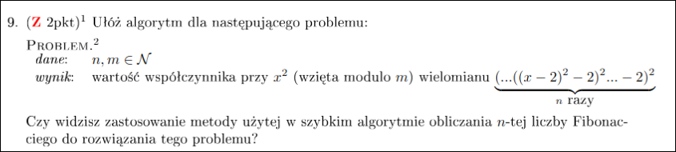

# Zadanie 2


```
for i <- i to n do:
	j <- i
	while j < n do:
		sum <- P(i, j)
		j <- j + 1
```


Pętla while wykona się $n - i$ razy dla ustalonego $i$.

1) koszt P(i, j) to $\Theta(1)$ 

	Koszt wywołania pętli while to $n-1$.
	$\sum_{i=1}^{n} n-i = n^2 - \frac{n(n+1)}{2} = \frac{n(n-1)}{2}=\Theta(n^2)$
2) koszt P(i, j) to $\Theta(j)$
   
	Koszt wywołania pętli while to $\Theta(\frac{n^2-i^2}{2})$ 
	$\sum_{i=1}^{n} \Theta(\frac{n^2-i^2}{2}) = \Theta(\frac{n^3 - \sum_{i=1}^{n} i^2}{2})=\Theta(\frac{n^3}{2} - \frac{n(n+1)(2n+1)}{12})=\Theta(n^3)$
	

```
for i <- i to n do:
	j <- i
	while j < n do:
		sum <- P(i, j)
		j <- j + j
```


1) koszt P(i, j) to $\Theta(1)$  
   
	Zewnętrzna pętla wykonuje się $\Omega(n)$ razy, więc stąd mamy ograniczenie dolne.
	Żeby znaleźć ograniczenie górne policzymy ile razy podwoi się $j$ w
	pętli while (czyli ile razy się ta pętla wykona).

	Dla $i\in [\frac{n}{2},n]$ pętla wykona się tylko raz, bo 
	podwojeniu $j$ wyskoczymy za $n$.

	Dla $i\in [\frac{n}{4},\frac{n}{2})$ pętla wykona się dwa razy, bo 
	podwojeniu $j$ najpierw wskoczymy do przedziału $[\frac{n}{2},n]$,
	a potem poza $n$.

	Widać, że liczbę wywołań określa taki ciąg: 
	$\frac{n}{2}\cdot 1 + \frac{n}{4}\cdot 2 + \frac{n}{8}\cdot 3
	+...+\frac{n}{2^k}\cdot k = n\sum_{k=1}^{logn} \frac{k}{2^k}$.

	Możemy oszacować tę sumę z góry przez sumę nieskończoną:

	$\frac{1}{2}$

	$\frac{1}{4} \;\;\;\frac{1}{4}$

	$\frac{1}{8} \;\;\;\frac{1}{8} \;\;\;\frac{1}{8}$

	$\frac{1}{16}\;$ $\frac{1}{16}$ $\;\frac{1}{16}$

	$\;\vdots \;\;\;\;\vdots\;\;\;\;\vdots$

	$1 + \frac{1}{2}+\frac{1}{4} +\cdots =2$

	Zatem $n\sum_{k=1}^{logn} \frac{k}{2^k}\leq 2n=O(n)$.

	Pokazaliśmy to dla $n$ będącego potęgą 2, mówimy, że złożoność jest
	monotoniczna, więc możemy ograniczyć dowolne $n$ z dwóch stron
	potęgami dwójek.

2) Koszt P(i, j) to $\Theta(j)$

	Obliczmy koszt wykonania wewnętrznej pętli while dla ustalonego $i$:

	$\Theta(i) + \Theta(2i) + \Theta(4i) + \cdots + 
	\Theta(2^{log\frac{n}{i}}\cdot i)=
	\Theta(i(1+2+4+\cdots+2^{log\frac{n}{i}}))=
	\Theta(i(2^{1+log\frac{n}{i}}-\frac{1}{2}))=
	\Theta(2i\cdot \frac{n}{i}-\frac{1}{2}i)=
	\Theta(n)$

	Ostatnia równość jest prawdziwa, bo $i$ jest maksymalnie $n$.

	Mamy $n$ wywołań głównej pętli, więc ostateczna złożoność to 
	$\Theta(n^2)$.

---

# Zadanie 3


---

# Zadanie 4


## Liczba wierzchołków

```
def verticies(T):
	if !T: return 0;
	return 1 + verticies(T.left) + verticies(T.right);
```

## Maksymalna odległość między wierzchołkami

```
def maxD(T)
	if !T: return 0, 0
	hL, maxDL = maxD(T.left)
	hR, maxDR = maxD(T.right)
	return max(hL, hR) + 1, max(hL+hR, maxDL, maxDR)
```

---

# Zadanie 5


## Wstawianie zadanego klucza do T

```
def insert(T, k):
	if k > t.key:
		if !t.right:
			t.right <- newTree(k)
		else:
			insert(T.right, k)
	else:
		if !t.left:
			t.left <- newTree(k)
		else:
			insert(T.left, k)
```

## Usuwanie wierzchołka z danym kluczem

```
def remove(T, k):
	if !T: return NULL

	if k > T.key:
		T.right = remove(T.right, k)
	else if k < T.key:
		T.left = remove(T.left, k)
	else: // k == T.key
		if T.left == NULL:
			temp <- T.right
			delete root // some sort of memory managment
			return temp
		else if T.right == NULL
			temp <- T.left
			delete root // some sort of memory managment
			return temp
		else:
			temp <- findMin(T.right)
			T.key <- temp.key
			T.right <- remove(T.right, temp.k)
	return T
```

```
def findMin(node):
	while node.left != null:
		node <- node.left
	return node
```


**Uzasadnienie:**
Jeżeli wierzchołek nie ma któregoś dziecka to możemy podpiąć to drugie w jego miejsce. Jeżeli wierzchołek ma obydwoje dzieci to w miejsce usuwanego wierzchołka możemy wstawić najmniejszy wierzchołek z prawego poddrzewa. Porządek zostanie zachowany, bo wszystkie elementy z lewego poddrzewa będą od niego większe a te z prawego większe. Wtedy musimy jeszcze tylko (rekurencyjnie) usunąć ten element z prawego poddrzewa.

## Znajdowanie następnego co do wielkości klucza

```
def findSuccessor(T, key):
	node <- findNode(T, key)
	if node == NULL: 
		return NULL
	if node.right != NULL:
		return findMin(node.right, NULL)
	successor <- NULL
	ancestor <- T
	while ancestor != node:
		if k < ancestor.key:
			successor <- ancestor
			ancestor <- ancestor.left
		else:
			ancestor <- ancestor.right
	return successor
```

**Uzasadnienie:**
Jeśli wierzchołek z szukanym kluczem ma prawe poddrzewo to jego następcą będzie minimalny wierzchołek w jego prawym poddrzewie. Jeżeli nie ma prawego poddrzewa to musimy się cofnąć do góry i znaleźć pierwszy wierzchołek, na drodze od wierzchołka z kluczem $k$ do korzenia, który jest lewym dzieckiem. Przodek tego lewego dziecka jest wtedy następcą wierzchołka z kluczem $k$, bo jest najmniejszym z większych wierzchołków.

---

# Zadanie 6


---

# Zadanie 7


Najpierw szukamy korzenia drzewa przechodząc przez listę krawędzi i patrząc, który wierzchołek jest bez ojca.

Tworzymy dwie tablice: wejście, wyjście. Będziemy tam zapisywali czasy wejścia i wyjścia do każdego wierzchołka.

Będziemy również utrzymywać globalną wartość $time$, którą będziemy zwiększać za każdym razem, gdy wejdziemy i wyjdziemy z wierzchołka.

Puszczamy DFS-a na tym drzewie, ustawiamy wartości $In$ i $Out$ dla każdego wierzchołka, inkrementując $time$ za każdym razem gdy wejdziemy lub wyjdziemy z wierzchołka.

$v_i$ leży na ścieżce z $u_i$ do korzenia $\Leftrightarrow$ $In[v_i] < In[u_i]$ and $Out[v_i] > Out[u_i]$ (dowód na kartce mam na razie) 

Pod koniec sprawdzamy dla każdej pary $\{v_i, u_i\}$ podany wyżej warunek, żeby sprawdzić, czy $v_i$ jest na drodze z $u_i$ do korzenia.

---

# Zadanie 8


Jak działa algorytm?


Proceudra `buduj - kopiec` zakłada że ostatni rząd w kopcu jest dobrze uporządkowany i dla każdego elemntu powyżej wykonujmy procedure `przesuń - niżej` dzięki której każdy uporządkowujemy dane drzewo. Co nam daje małe dobrze zbudowane kopce, dzięki którym tworzymy większy kopiec.

## Złożoność 

Zauważmy ża dla każdego wierzchołka w jednym z różwoych trójkątów, schodzimy w dół co najwyżej raz.
Czyli dla np. korzenia możemy zejść co najwyżej 3 razy (znajduje się w 3 trójkątach) 

Aby obliczyć złożoność zliczmy ile razy każdy wierzchołek może zejść w dół.
Zauważmy że kopiec n elementowy ma $2^{\lfloor log(n) \rfloor}$ poziomów

$$
\frac{n}{2} + \frac{n}{4}+\frac{n}{8} + ... +\frac{n}{2^{\lfloor log(n) \rfloor}}= n\cdot\sum^{log(n)}_{k=1} \frac{1}{2^k} \leq n \cdot\sum^{\infty}_{k=1} \frac{1}{2^k} = n \cdot 2 
\\
= O(n)
$$


---

# Zadanie 9



$a_n x^2 + b_n x + c_n$ 

dopisujemy + 2 na koniec bo to nie zmienia współczynnika przy $x^2$ ale pomaga przy liczeniu

Interesują nas tylko pierwsze 3 współczynniki, dlatego przy wymnażaniu kolejnych elementów pomijamy wszystkie rzeczy przy $x$ o potędze większej niż 2. I tak to co przy nich stoi nie wpływa na $x^2$, ani tym bardziej na $x$ i wyraz wolny.

wypiszmy wyrazy:
$x - 2$ 
$x^2 -4x+2$ 
$20x^2 -16x+2$ 

$c_n$ to będzie zawsze 2 bo wyraz wolny zależy tylko od wyrazu wolnego

$b_1 = 4$ 
można zapisać zależności dla $b_n$
$b_n = 2b_{n-1}c_{n-1} = 4*b_{n-1} = - (4^n)$ 

tak samo zapisujemy zależność dla $a_n$

$a_1 = 1$
$a_2=20$
$a_3=336$ 
$a_n = 2*a_{n-1}*c_{n-1} + b_{n-1}^2 = 4*a_{n-1} + 16^n$

robimy macierzowanie jak u fibonacciego, za każdym razem robiąc modulo m.

$$  
\begin{bmatrix}
4 & 1 \\ 0 & 16
\end{bmatrix}^n
\begin{bmatrix}
1 \\ 16
\end{bmatrix}
=
\begin{bmatrix}
a_n \\ 16^{n}
\end{bmatrix}
$$

Przykłady:
$$  
\begin{bmatrix}
4 & 1 \\ 0 & 16
\end{bmatrix}
\begin{bmatrix}
1 \\ 16
\end{bmatrix}
=
\begin{bmatrix}
20 \\ 16^2
\end{bmatrix}
$$

$$  
\begin{bmatrix}
4 & 1 \\ 0 & 16
\end{bmatrix}
\begin{bmatrix}
20 \\ 16^2 
\end{bmatrix}
=
\begin{bmatrix}
4 & 1 \\ 0 & 16
\end{bmatrix}^2
\begin{bmatrix}
1 \\ 16
\end{bmatrix}
=
\begin{bmatrix}
336 \\ 16^3
\end{bmatrix}
$$

# Zadanie 10


Zmieniamy graf na skierowany. Dla każdego wierzchołka jego waga staje się wagą każdej krawędzi która do niego wchodzi.

Odpalamy Dijkstre na takim grafie. Jako, że zaczynamy z jakiegoś wierzchołka, to zaczynamy z kosztem zero. Musimy potem dodać koszt startowego wierzchołka do kosztu każdego wierzchołka.

pokazujemy, że stworzona ścieżka jest równa tej gdzie wagi są na wierzchołkach
**Dowód**
Weźmy dowolną najkrótszą ścieżkę $S = (v, v_1, v_2, \: ...,v_k, u)$  na grafie $G'$ od $v$ do $u$. Pokażemy, że w grafie $G$ to również jest najkrótsza ścieżka od $v$ do $u$.

Pierwszym wierzchołkiem w ścieżce jest $v_1$, czyli w $G'$ krawędź $(v, v_1)$ ma najmniejszą wagę z krawędzi wychodzących z $v$. Ale to jest równoważne temu, że $v_1$ ma najmniejszą wagę ze wszystkich sąsiadów $v$ w grafie $G$. Indukcyjnie pokazujemy, że tak samo jest dla każdej pary $v_k, v_{k+1}$. Czyli droga z $G'$ przechodzi 1-1 na $G$.

Wiemy, że Dijkstra działa i znajduje najkrótsze ścieżki.

# Zadanie 11


Tak, algorytm poprawnie wylicza długości tych ścieżek.
Algorytm Dijkstry nie działa z negatywnymi wagami, bo nie updateuje raz odwiedzonych już wierzchołków.
Negatywne wagi też nie są odpowiednie, bo może się okazać, że przez nie tworzy nam się ścieżka (która nie jest prosta) o koszcie $-\infty$.

Na poniższym przykładzie widać, że algorytm Dijkstry nie zadziała. Zaczynając w A ustawi koszt dojścia do C na 2. Następnie kiedy odwiedzi B, to nie rozważy drogi do C, bo C jest już wśród odwiedzonych wierzchołków. Czyli koszt C pozostanie 2, nie zostanie uaktualniony do -5.

Teraz rozważmy sytuację, gdy zaczynamy z wierzchołka A, który jest połączony jedną (jedyną) krawędzią z negatywną wagą z jakimś wierzchołkiem B.

Gdy zaczynamy w A to algorytm rozpatruje C i B, i ustawia ich koszty dojścia. Gdy przejdzie do C to nigdy nie będzie rozpatrywać kosztu B drugi raz. Ale teraz to nam nie przeszkadza, wiemy, że koszt do B i tak nie mógłby być mniejszy, bo już teraz jest $< 0$. Wszystkie inne wagi mogły być co najmniej 0, więc droga z A do B zawsze będzie najkrótsza.

Normalnie pojawia się też problem tego, że przy ścieżkach nie prostych, z negatywnymi wagami, możemy mieć ścieżkę, która nie będzie miała najkrótszego kosztu (ten koszt będzie wynosić $-\infty$). Ale ten edge-case jest tutaj pomijany przez założenie, że interesują nas jedynie długości ścieżek prostych. Nie rozważamy w nich dwa razy tego samego wierzchołka, więc nie interesują nas takie sytuacje, gdzie możemy się zapętlać na wierzchołku z negatywną wagą.
