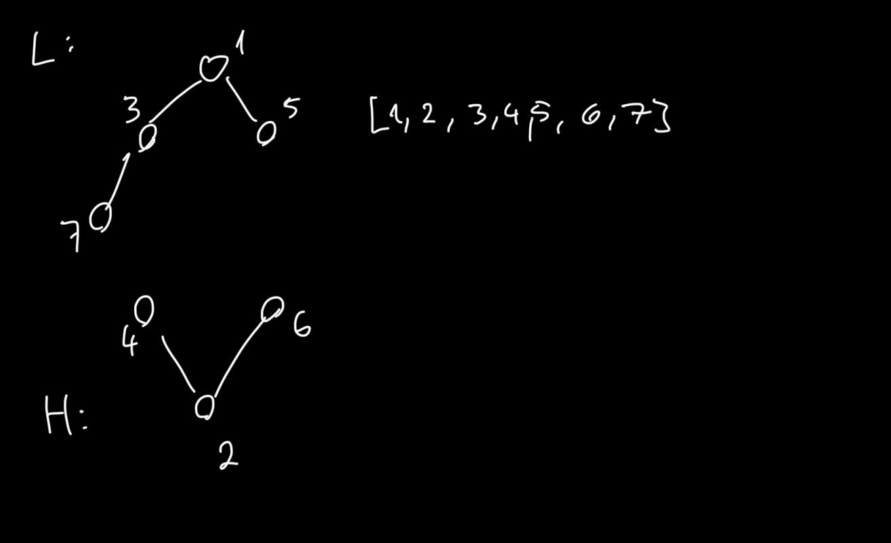

y# Zadanie 1




```
Heap {
	arr : [ T ]
	min_heap_size : int
	max_heap_size : int
}

function min_h(n): return 2n
function max_h(n): return 2n - 1
```

Oba kopce trzymamy w jednej tablicy.
Elementy kopca minimalnego będą na pozycjach parzystych, a maksymalnego na nieparzystych.

### Przywracanie Porządku

```
fn min_move_down(h, i):
	do
		curr = i
		if 2curr < h.min_heap_size && h.arr[min_h(i)] > h.arr[min_h(2curr)]:
			i = 2curr
		if 2curr + 1 < h.min_heap_size && h.arr[min_h(i)] > h.arr[min_h(2curr + 1)]:
			i = 2curr + 1

		swap(h.arr[min_h(i)], h.arr[min_h(curr)])
	while i != curr

	if 2i > h.min_heap_size: // Leaf of min heap
		max_el = i // Correcsponding element in max heap
		if max_el > h.max_heap_size:
			max_el //= 2
	
		if h.arr[min_h(i)] > h.arr[max_h(max_el)]:
			swap(h.arr[min_h(i)], h.arr[max_h(max_el)])
			max_move_up(h, max_el)


fn max_move_down(h, i):
	do
		curr = i
		if 2curr < h.max_heap_size && h.arr[max_h(i)] < h.arr[max_h(2curr)]:
			i = 2curr
		if 2curr + 1 < h.max_heap_size && h.arr[max_h(i)] < h.arr[max_h(2curr + 1)]:
			i = 2curr + 1

		swap(h.arr[max_h(i)], h.arr[max_h(curr)])
	while i != curr

	if 2i > h.max_heap_size: // Leaf of max heap
		min_el = i
		if 2min_el <= h.min_heap_size:
			min_el = 2min_el
	
		if h.arr[max_h(i)] < h.arr[min_h(min_el)]:
			swap(h.arr[max_h(i)], h.arr[min_h(min_el)])
			min_move_up(h, min_el)


fn min_move_up(h, i):
	while i > 1 && (h.arr[min_h(i)] < h.arr[min_h(i//2)]):
		swap(h.arr[min_h(i)], h.arr[min_h(i//2)])
		i //= 2

fn max_move_up(h, i):
	while i > 1 && (h.arr[max_h(i)] > h.arr[max_h(i//2)]):
		swap(h.arr[max_h(i)], h.arr[max_h(i//2)])
		i //= 2
```

### Operacje Deletemin/max

```
fn deletemin(h):
	// Chech if min is not empty
	
	if h.min_heap_size > h.max_heap_size:
		h.arr[min_h(1)] = h.arr[min_h(h.min_heap_size)]
		h.min_heap_size--
	else:
		h.arr[min_h(1)] = h.arr[max_h(h.max_heap_size)]
		h.max_heap_size--

	min_move_down(h, 1)


fn deletemax(h):
	// Check if max is not empty

	if h.max_heap_size < h.min_heap_size:
		h.arr[max_h(1)] = h.arr[min_h(h.min_heap_size)]
		h.min_heap_size--
	else:
		h.arr[max_h(1)] = h.arr[max_h(h.max_heap_size)]
		h.max_heap_size--

	max_move_down(h, 1)
```

---

# Zadanie 2


Algorytm powinien to dobrać tak, żeby $a$ oraz $a + r$ to były jakieś liczby z list $L_i$.

Mamy $k$ wskaźników, po jednym dla każdej listy. 
Algorytm:

1) szukamy min i max wśród wskaźników, różnica między nimi to nasze $r$ (uaktualniamy $r$ jeśli akurat się zmniejszyło)
2) przesuwamy min wskaźnik w prawo, bo to daje nam szansę zminimalizowania $r$

Powtarzamy dopóki wskaźnik minimum nie będzie na końcu listy

**Jak efektywnie przechowywać wskaźniki?**
W każdym kroku przesuwamy tylko jeden wskaźnik, dlatego nie ma sensu za każdym razem szukać od nowa min i max. Użyjmy kopca min-max do przechowywania wskaźników. Kluczami będą wartości na które wskazują te wskaźniki.

**Jak ma działać algorytm na tym kopcu?**
Przy obliczaniu po prostu sczytamy min i max wskaźniki w czasie $O(1)$.
Przy przesuwaniu minimalnego wskaźnika zrobimy tak:
- przesunąć wskaźnik i zmienić jego wartość w kopcu
- uruchomić procedurę naprawy kopca (przywracania porządku)

**Złożoność algorytmu**
Pamięciowa - $O(k$), bo mamy kopiec z k elementami
$n$ - długość $L_i$
Czasowa - $O(k * n * log\:k)$ 

**Poprawność**
załóżmy, że nasz algorytm zwrócił $r$, ale istnieje $r^*$ takie, że $r^* < r$.
Czyli istnieje też przedział $[a^*, a^* + r^*]$.
Załóżmy, że $a^* \in L_j$ (bo element należy do jednej z list)

Nasz algorytm w końcu rozważy $a^*$ (bo ...)
Wtedy wszystkie wartości wskaźników są większe równe $a^*$ 

TODO

---

# Zadanie 3


Znowu kopiec...

### Przygotowanie

Dla każdego wierzchołka liczymy ile ma krawędzi wchodzących.

### Stan Początkowy

Tworzymy kopiec i umieszczamy w nim wierzchołki, do których nie prowadzi żadna krawędź.

### Iteracja

Dopóki kopiec nie jest pusty:

- Wyjmij najmniejszy element z kopca (względem utożsamionej liczby naturalnej)
- Wpisz go do porządku topologicznego
- Dla każdego wierzchołka do którego prowadzą krawędzie z wybranego:
	- Zmniejsz liczbę krawędzi wchodzących o jeden
	- Jeżeli to była ostatnia krawędź wchodząca to dodaj go do kopca

### Złożoność Czasowa

Przejrzymy każdy wierzchołek oraz każdą krawędź.
Dodatkowo w kopcu być może umieścimy wszystkie wierzchołki, więc $O(n \log(n) + m)$.

### Dowód

**Lemat:**
W każdym momencie w kopcu są przechowywane wszystkie elementy możliwe do wybrania jako następny w porządku topologicznym.

W pierwszej iteracji są wszystkie bez wierzchołków wchodzących.
W kolejnych dodajemy do kopca wszystkie, krawędzie które nie mają wchodzących krawędzi. Każdy inny wierzchołek ma więc wchodzące krawędzie i nie może zostać użyty.

**Teza:**
Algorytm w wybiera najlepszy możliwy ciąg.

Załóżmy, że istnieje *lepszy* ciąg wierzchołków $L = (l_{1},l_{2},\dots)$ od wybranego $W=(w_{1},w_{2},\dots)$. Oznacza to, że istnieje najmniejsze takie $i$, że $l_{i}\ne w_{i}$. W tym miejscu algorytm wybrał $w_{i}$ najmniejsze możliwe, oraz z lematu miał dostęp do wszystkich możliwych, stąd $l_{i} > w_{i}$, więc $L > W$.

---

# Zadanie 4


### Interpretacja

Utwórzmy graf, którego wierzchołkami są litery alfabetu.
Dla każdego słowa dodamy krawędź *skierowaną* pomiędzy oboma literami (bez powtórzeń).

**Obserwacja (1):** Każda ścieżka w grafie jest nad-słowem wszystkich takich słów, dla których przechodzi przez odpowiadające im krawędzie.

Chcemy więc znaleźć takie ścieżki, które pokrywają wszystkie krawędzie grafu, wtedy nad-słowem zbioru słów $W$ będzie konkatenacja wszystkich słów odpowiadających ścieżkom.

**Obserwacja (2):** Jeżeli dwie ścieżki się pokrywają, to możemy wziąć rozłączne ścieżki pokrywające ten sam zbiór krawędzi, a wtedy nad-słowo będzie nie-dłuższe.

**Obserwacja (3):** Jeżeli mamy ścieżki rozłączne, to mniejszy koszt będzie mieć takie rozwiązanie, gdzie ścieżek jest mniej.

### Problem-Inaczej

Znaleźć minimalną liczbę rozłącznych ścieżek pokrywających graf, czyli edge-path-cover.

> To jest NP trudne dla wierzchołków

### Rozwiązanie

Będziemy rozważać każdy krawędziowo-spójny podgraf osobno.
W takim podgrafie, jeżeli każdy wierzchołek ma stopień wejściowy równy stopniowi wyjściowemu, lub istnieją co najwyżej dwa wierzchołki o nierówynych stopniach, to istnieje odpowiednio cykl Eulera lub ścieżka Eulera dla tego podgrafu – jest to najlepszy sposób na przejście wszystkich krawędzi tego grafu.

Jeżeli w grafie istnieją wierzchołki, z których wychodzi więcej wierzchołków niż do nich wchodzi, to by pokryć wszystkie krawędzie z każdego takiego wierzchołka musiała by wychodzić ścieżka. Suma stopni wejściowych i wyjściowych jest taka sama, więc dla każdego wejścia istnieje wierzchołek z większym stopniem wejściowym, który będzie końcem danej ścieżki.

> Przejście wszystkimi krawędziami w takim podgrafie wymaga więc tylu ścieżek ile łącznie brakuje krawędzi wchodzących w wierzchołkach z nierównością.

Łącząc początki i końce takich ścieżek dodatkowymi krawędziami możemy otrzymać graf, gdzie wszystkie wierzchołki mają stopnie wejściowe równe stopniom wyjściowym.

#### Taki Graf Zawiera Cykl Eulera

##### Zaczynamy i Kończymy w Wybranych Wierzchołkach

Załóżmy nie wprost, że najdłuższa ścieżka zaczyna się i kończymy w różnych wierzchołkach. Z tych wierzchołków wychodzimy/wchodzimy inną ilość razy, ale ich stopnie są równe -> można przedłużyć dodając krawędzie.

##### Przejdziemy Każdy Wierzchołek

Załóżmy nie wprost, że najdłuższa ścieżka nie przechodzi przez wierzchołek $v$. Wtedy istnieje nieskierowana droga z $v$ do najbliższego wierzchołka ścieżki. Przed ostatnim wierzchołkiem na tej ścieżce jest $u$, które nie jest na ścieżce.
Pewna krawędź łączy $u$ ze ścieżką. Jeżeli ustalimy początek/koniec cyklu w wierzchołku połączonym z $u$, to będziemy mogli wydłużyć ścieżkę o krawędź do $u$. Sprzeczność.

##### Odwiedzimy Każdą Krawędź

Załóżmy, że najdłuższa ścieżka nie przechodzi przez pewną krawędź. Niech wychodzi ona z wierzchołka $v$.
Przejdziemy przez każdy wierzchołek, więc jeśli ustalimy, że kończymy w $v$, to możemy przedłużyć ścieżkę o tą krawędź.

#### Konstrukcja Cyklu Eulera

Wybieramy arbitralnie wierzchołek $v$. Algorytmem DFS szukamy cyklu $v\leadsto v$. Wszystkie odwiedzone krawędzie *chowamy* i powtarzamy algorytm dla wierzchołka cyklu, w którym zostały jeszcze jakieś krawędzie.

Dalej nadal zostają same cykle, bo usuwamy tyle samo wchodzących i wychodzących krawędzi dla każdego wierzchołka.
Te cykle będziemy *wciskać w wierzchołki*.

#### Odtworzenie Słowa

Dla każdej spójnej składowej mamy w tym momencie cykl Eulera.
By otrzymać słowa zaczniemy w pewnym wierzchołku połączonym z *udawaną* krawędzią i wypisując wszystkie litery pominiemy pierwszą krawędź którą przejdziemy (tą udawaną).

##### Czy Jest To Minimum?

Jeżeli spójny-krawędziowo podgraf składał się początkowo z $k$ dodatkowych krawędzi i $n$ oryginalnych, to oznacza to, że istniało w nim $k$ różnych początków ścieżek.
Minimalny koszt wynosił więc $n + k$.

Jeżeli dodamy do grafu $k$ krawędzi i przejdziemy wszystkie jedną ścieżką, to mamy koszt $k + n + 1$, ale pominięcie pierwszej krawędzi sprowadza nas z powrotem do $n + k$, czyli optymalnej ilości.

Jeżeli podgrafy są początkowo rozłączne, to oczywiście budowa jednego nie może wpłynąć  w żaden sposób na drugi.

### Złożoność Obliczeniowa

#TODO

---

# Zadanie 5


#TODO 

> Topo-sort + DP