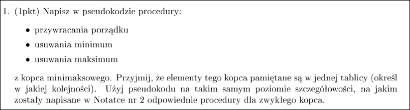
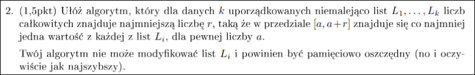
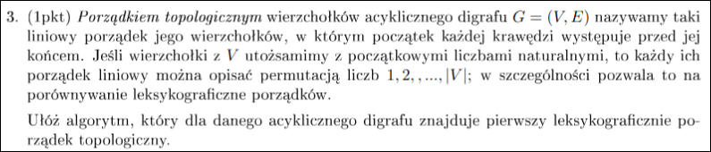
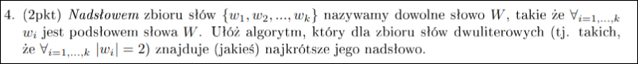
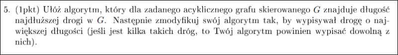

# Zadanie 1

---

# Zadanie 2

Algorytm powinien to dobrać tak, żeby $a$ oraz $a + r$ to były jakieś liczby z list $L_i$.

Mamy $k$ wskaźników, po jednym dla każdej listy. 
Algorytm:
1) szukamy min i max wśród wskaźników, różnica między nimi to nasze $r$ (uaktualniamy $r$ jeśli akurat się zmniejszyło)
2) przesuwamy min wskaźnik w prawo, bo to daje nam szansę zminimalizowania $r$
Powtarzamy dopóki wskaźnik minimum nie będzie na końcu listy

**Jak efektywnie przechowywać wskaźniki?**
W każdym kroku przesuwamy tylko jeden wskaźnik, dlatego nie ma sensu za każdym razem szukać od nowa min i max. Użyjmy kopca min-max do przechowywania wskaźników. Kluczami będą wartości na które wskazują te wskaźniki.
**Jak ma działać algorytm na tym kopcu?**
Przy obliczaniu po prostu sczytamy min i max wskaźniki w czasie $O(1)$.
Przy przesuwaniu minimalnego wskaźnika zrobimy tak:
- przesunąć wskaźnik i zmienić jego wartość w kopcu
- uruchomić procedurę naprawy kopca (przywracania porządku)
**Złożoność algorytmu**
Pamięciowa - $O(k$), bo mamy kopiec z k elementami
$n$ - długość $L_i$
Czasowa - $O(k * n * log\:k)$ 
**Poprawność**
załóżmy, że nasz algorytm zwrócił $r$, ale istnieje $r^*$ takie, że $r^* < r$.
Czyli istnieje też przedział $[a^*, a^* + r^*]$.
Załóżmy, że $a^* \in L_j$ (bo element należy do jednej z list)

Nasz algorytm w końcu rozważy $a^*$ (bo ...)
Wtedy wszystkie wartości wskaźników są większe równe $a^*$ 

TODO

---

# Zadanie 3

---

# Zadanie 4

---

# Zadanie 5

