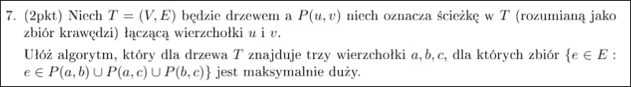

# Zadanie 1


---

# Zadanie 2


### Strategia Zachłanna

Posortujmy odcinki *rosnąco* względem $k_{j}$. Analizujmy je w tej kolejności.
Dla każdego odcinka:

- Jeżeli przetwarzany zaczyna się po końcu *aktualnego*, to ustaw przetwarzany na aktualny (i dodaj aktualny do zbioru $S$)

### Dowód

Ustalmy kolejność odcinków rosnąco (względem pozycji), wtedy odcinki wyznaczone przez algorytm to $S = (I_{1},\dots,I_{n})$. Niech pewne optymalne odcinki wyznacza ciąg $O = (I'_{1},\dots,I'_{m})$.
Pokażmy indukcyjnie, że $k(I_{i}) \le k(I'_{i})$ – czyli $i$-ty odcinek rozwiązania algorytmu kończy się nie później niż w rozwiązaniu optymalnym.

**Podstawa Indukcji:**
Algorytm wybierze jako pierwszy odcinek z minimalnym $k$, więc oczywiście zachodzi warunek $k(I_{0}) \le k(I'_{0})$, bo zachodzi dla wszystkich możliwych odcinków.

**Krok Indukcyjny:**
Załóżmy, że do pewnego $n$ zachodzi $k(I_{n}) \le k(I'_{n})$. Pokażmy, że po tym kroku nierówność nadal zachodzi.

Algorytm zachłanny przejrzy wszystkie odcinki kończące się dalej niż $k(I_{n})$, a następnie wybierze najwcześniejszy możliwy odcinek odcinek.
W szczególności $I'_{n+1}$ zaczyna się po $I_{n}$, więc algorytm zachłanny weźmie odcinek nie późniejszy. Nierówność zachodzi.

---

# Zadanie 3


### Strategia

Jeżeli do wydania jest $r$, to wydaj w tym kroku $F_{i} \le r$ takie, że $i$ jest największe.

### Dowód

#### Używane Są Różne Monety

Dla każdego $r$ naturalnego istnieje liczba Fibonacciego $F_{i}$ taka, że $F_{i}\le r < F_{i+1}$.
Jeżeli do wydania $r$ w pewnej iteracji użyjemy takiego $F_{i}$, że $F_{i} \le r < F_{i+1}$, to nie będziemy mogli użyć drugi raz $F_{i}$, ponieważ:
$$\begin{align*}
F_i \le r &< F_{i+1} = F_{i-1} + F_{i}\\
0 \le r - F_{i} &< F_{i-1}
\end{align*}$$
Czyli do wydania zostanie wartość mniejsza niż $F_{i-1}$.

#### Każdą Wartość Da Się Wydać

$T(n):$ Algorytm potrafi wydać każdą liczbę mniejszą niż $n$.

$T(1):$ potrafimy wydać $1$

Załóżmy $T(n)$. Pokażmy, że zachodzi $T(n+1)$:
Wybierzmy $F_{i}$ takie, że $F_{i}\le n < F_{i+1}$. Wtedy potrafimy z indukcji wydać $n-F_{i}$, więc potrafimy również $n$.

### Czy Liczba Monet Jest Optymalna?

$T(n):$ resztę $n$ najlepiej wydać zaczynając od $F_{i} \le n < F_{i+1}$.

$T(1):$ oczywiste (jedyna nasza opcja)

Załóżmy, że $T(k)$ zachodzi dla każdego $k$ mniejszego niż pewne $n$. Pokażmy $T(n)$:
Niech będzie $F_{i}\le n < F_{i+1}$. Wtedy jeżeli nie weźmiemy $F_{i}$, to musimy wziąć $F_{i-1}$, bo inaczej zabraknie nam elementów do uzyskania $n$.
$$\begin{align*}
F_{i} &\le n < F_{i+1}\\
F_{i-2} + F_{i-1} &\le n < F_{i-1} + F_{i}\\
F_{i-2} &\le n - F_{i-1} < F_{i}
\end{align*}$$
$$\begin{align*}
\sum\limits_{k=1}^{i-1}F_{k} &= F_{i+1}-1\\
\sum\limits_{k=1}^{i-1}F_{k} - F_{i-2} &= F_{i} -1
\end{align*}$$
Stąd jeżeli nie bierzemy $F_{i}$, to bierzemy $F_{i-1}$ i $F_{i-2}$, a w takim wypadku lepiej wziąć po prostu $F_{i}$.

> To niby nie jest wszystko do dowodu optymalności, ale no *prawie* wszystko (zwłaszcza jeżeli mamy rekurencyjny algorytm).

#### Dowód Sumy

Indukcyjnie załóżmy, że dla pewnego $n$ zachodzi równanie:
$$\begin{align*}
\sum\limits_{i=1}^{n}F_{i} &= F_{i+2} - 1
\end{align*}$$
Równanie zachodzi dla $n=1$, bo $F_{1} = 1 = 2 -1 = F_{3} - 1$.
Załóżmy tezę dla pewnego $n$ pokażmy dla $n+1$:
$$\begin{align*}
\sum\limits_{i=1}^{n+1}F_{i} &= \sum\limits_{i=1}^{n}F_{i} + F_{n+1} = F_{i+2} + F_{i+1} - 1 = F_{i+3} - 1
\end{align*}$$
Więc teza indukcyjna zachodzi.


---

# Zadanie 4


#TODO opisać kod i algorytm

```
for i in {1 ... n}
	d[i] = 0

k = make_heap()
wynik = 0
for i in {1 ... n}
	k.insert((k, i))
	if m >= r[i]:
		m = m - r[i]
		continue

	(kara, dzien) = k.pop()
	d[dzien] = 1
	wynik = wynik + kara
	m = m + 100
```

---

# Zadanie 5


**Obserwacja 1:**
Dla $k=0$ mamy $V' = V$.

#### Lemat 1

Suma dwóch zbiorów które spełniają warunek również spełnia warunek dla $k$ również spełnia warunek dla $k$.

Dla każdego elementu doliczymy się do $k$ sprawdzając jedynie elementy poprzednio zawarte w jego podzbiorze.

**Wniosek:**
Jeżeli $V'_{k},V'_{k+1}$ są największe możliwe, to zachodzi $V'_{k} \cup V'_{k+1} = V'_{k}$, czyli $V'_{k+1}\subseteq V'_{k}$.

#### Lemat 2

Jeżeli wierzchołek $v\in S$ nie spełnia wymagań, to nie spełnia wymagań również w $S\setminus U$ (oczywiście $v\notin U)$.

Usunięcie jakiegokolwiek wierzchołka z $S$ obniża ilość wierzchołków do których istnieje krawędź lub do których nie istnieje krawędź. By $v$ zaczął spełniać wymagania potrzebowalibyśmy podnieść jedną (obie) te wartości.

**Obserwacja 1:**
Usunięcie wierzchołka może spowodować, że inny wierzchołek przestanie spełniać warunek w mniejszym zbiorze. Jego również należy usunąć.

**Wniosek:**
By znaleźć $V'_{k}\subseteq S$ należy usunąć z $S$ wszystkie wierzchołki, które nie spełniają warunku.
Będziemy powtarzać ten proces, ponieważ usunięcie wierzchołka może potencjalnie sprawić, że inny wierzchołek przestanie spełniać warunek.

**Obserwacja 2:**
Nie interesują nas krawędzie wielokrotne – liczymy różnych sąsiadów, a nie krawędzie wychodzące do nich.

### Algorytm

Weź zbiór $V$. Dopóki istnieje w nim wierzchołek nie spełniający warunku, to usuń go i sprawdź jeszcze raz pozostałe.

#### Optymalizacja Implementacji

Chcemy, by w każdym momencie możliwe było określenie w czasie stałym:

- Do ilu wierzchołków z $V'$ istnieje krawędź
- Do ilu wierzchołków z $V'$ nie istnieje krawędź
- Które wierzchołki nie spełniają wymagań.

W tym celu utworzymy tablicę linked-list w taki sposób, by w $i$-tej linked list znajdowały się jedynie elementy, które posiadają $i$ krawędzi łączących je z innymi elementami z $V'$.

Wtedy wiemy, że wszystkie wierzchołki przechowywane w listach indeksowanych $i<k$ nie spełniają pierwszego warunku, a te dla których $i > |V'|-k$ również.

**Obserwacja 3:**
Wierzchołki podczas działania algorytmu będą przesuwać się jedynie na mniejsze indeksy.

##### Inicjalizacja

Dla każdego wierzchołka policzmy jego stopień wyjściowy i umieśćmy go w odpowiedniej linked-list. To zajmie nam czas $O(V + E)$.

Ustawmy również *brzegowe* wskaźniki $l=0,r=n$.

##### Krok Algorytmu

Jeżeli $l=k\land r = |V'|-k$, to zakończ.

Jeżeli $r > |V'| - k$, to weź pierwszy wierzchołek z $r$-tej listy i *usuń go*. Jeżeli lista jest pusta zmniejsz $r$ o jeden. Powtórz.

Jeżeli $l < k$, to weź pierwszy element z $l$-tej listy i *usuń go*. Jeżeli lista jest pusta, to zwiększ $l$ o jeden. Powtórz.

*usuń element(v):*
Dla każdego sąsiada, który jest w $V'$ (oraz w liście $i$):

- Usuń go z listy $i$
- Dodaj go do listy $i-1$
- $l \leftarrow \min(l,i-1)$

Na końcu $V'\leftarrow V'\setminus\{v\}$.

#### Złożoność Czasowa

Inicjalizacja zajmuje $O(V + E)$.
Następnie wykonując algorytm dla każdego usuniętego wierzchołka przejrzymy wszystkie jego krawędzie oraz wykonamy operacje stało-czasowe dla każdej z nich.
Każdą krawędź przejrzymy jedynie dla wierzchołka z którego wychodzi, więc aproksymuje się to do czasu $O(E)$.

Jeżeli martwiące jest możliwe wielokrotne przeskakiwanie wskaźnika $l$, to można trzymać jakąś listę pełnych linked-list, by od razu skakać do pełnych, a  nie szukać ich.

---

# Zadanie 6


**Lemat 1**
Załóżmy, że mamy drzewo maksymalnie pokolorowane (n kolorowań) dla pewnego k. Po doczepieniu s wierzchołków (przynajmniej 1 dla każdego liścia) będzie pokolorowane dla $k' = k + 2$ przez $n + s$ wierzchołków (kolorujemy te nowe liście)

**D-d**
Po doczepieniu każda ścieżka liściowa zwiększyła swoją długość o 2 
(mogły się też pojawić nowe liście, ale wtedy jako starą ścieżkę liściową liczymy ścieżkę od ojców nowych liści).

Skoro $k' = k + 2$ to możemy pokolorować wszystkie nowe liście, nie przekroczymy
$k'$ bo najdłuższe ścieżki (ścieżki liściowe) nie przekraczają $k'$.

**ZNWP**, że to nie jest maksymalne kolorowanie. Wtedy moglibyśmy pokolorować 
jeszcze jeden wierzchołek, ale to nie mógłby być liść w $T'$. Zatem pokolorujmy 
jakiś inny wierzchołek wyżej. 

Ale teraz usuńmy nowo pokolorowane liście i wróćmy do starego $k$. 
Tylko, że tym razem w tym kolorowaniu mamy 1 dodatkowy wierzchołek, czyli 
dostajemy sprzeczność bo tamto stare kolorowanie było maksymalne dla tego $k$.

**Algorytm**

Przypadki bazowe:

- k = 1: możemy pokolorwać tylko 1 wierzchołek w drzewie

- k = 2: kolorujemy wszystkie liście (czemu to jest poprawne?)

Przypadek indukcyjny: (k > 2)

Zakładamy, że umiemy pokolorować drzewa o $x \leq n$ wierzchołkach dla pewnego $k$

Jeśli chcielibyśmy pokolorować drzewo dla $n + 1$ wierzchołków to odczepiamy wszystkie liście, zmniejszamy $k$ o 2 i kolorujemy 'indukcyjnie' nasze mniejsze drzewo.

Następnie przyczepiamy liście i zwiększamy $k$ o 2. Kolorujemy wszystkie liście.
Z **Lematu 1** to kolorowanie będzie maksymalne.

---

# Zadanie 7



## Lemat 1

$P(a,b)$, $P(a,c)$, $P(b,c)$ mają 1 wspólny wierzchołek $v$.

**D-d**

1) istnieje taki punkty wspólny, bo inaczej cykl
2) nie mogą mieć więcej, bo się cykle porobią
## Lemat 2

Dwa z trzech wierzchołków $a,b,c$ muszą być najbardziej oddalonymi wierzchołkami (krańcami średnicy).

**D-d**

Weźmy wierzchołki $a$, $b$, $c$, załóżmy, że dają maksymalnie dużo krawędzi.

Jeśli wśród nich nie ma żadnego krańca średnicy to BSO weźmy sobie $a$.
Z $a$ możemy pójść do najbardziej oddalonego wierzchołka od niego (znalezionego dfs-em) i dostać lepszy wynik. Zamieniamy $b$ lub $c$ z tym nowym najdalszym wierzchołkiem (jeżeli jest on w poddrzewie $v$, $b$ to zamieniamy go z $b$, analogicznie dla $c$). Powtarzamy tę procedurę jeszcze raz, tym razem biorąc ten nowy wierzchołek.

## Lemat 3

Niech $a$, $b$ są krańcami średnicy $T$. Najbardziej oddalony od $ab$ wierzchołek $c$ da maksymalny wynik. Czyli wynik nie zależy od wyboru średnicy.

**D-d**

Niech $(a,b,c)$ i $(x,y,z)$ to wierzchołki, $a,b,x,y$ to krańce dwóch średnic, $c$ jest najbardziej oddalonym wierzchołkiem od $ab$, $z$ analogicznie dla $xy$.

**ZNWP**, że $R(a,b,c) < R(x,y,z)$, gdzie $R$ to funkcja licząca wierzchołki jak w zadaniu.

Skoro $P(a,b)=P(x,y)$ to $P(c,ab) < P(z,xy)$

Z założeń mamy:
- $P(c,xy) \leq P(z,xy)$
- $P(x,ab),P(y,ab),P(z,ab) \leq P(c,ab)$, analogicznie dla $z$ i $xy$

Niech y_ab to kraniec $P(y, ab)$.
**BSO** niech $y$ i $b$ oraz $a$ i $x$ są obok siebie, niech $z$ łączy się z y_ab.

$P(a, x\_ab) = P(x, x\_ab)$ oraz  $P(b, y\_ab) = P(y, y\_ab)$, bo to średnice.

$P(y,ab) \leq P(c,ab) < P(z,xy)$, co daje nam sprzeczność, bo $xy$ to średnica, a wyszło nam, że $P(x,z) > P(x,y)$

x -> x_ab -> y_ab -> y
x -> x_ab -> y_ab -> z
## Algorytm

Znajdujemy dwa najbardziej oddalone wierzchołki dwoma dfsami. $O(n + m)$

odpalamy dfsa z jednego z wierzchołków średnicy i liczymy wierzchołki najbardziej oddalone od średnicy. Jak mamy krawędź $v \rightarrow u$ to jeśli oba są na średnicy to nic nie robimy a w p.p. $d[u] = d[v]+1$  

---

# Zadanie 8


**Obserwacja 1:**
Każdy element należy przesunąć w lewo lub w prawo. Dla elementu $i$ wyznaczmy potrzebę przesunięcia przez $m_{i}$ – dodatnie jeśli w prawo, ujemne jeśli w lewo.
Operacja *swap* przesuwa jeden element w lewo, a drugi w prawo.

**Lemat 1:**
$\sum\limits_{i}m_{i} = 0$. 
Permutacja $\sigma$ powstała poprzez wykonywanie swap na permutacji $\pi$. Każda operacja *swap* zwiększa jedno $m_{j}$ o $k$, a inne $m_{i}$ zmniejsza o $k$.

**Lemat 2:**
Optymalne rozwiązanie ma koszt $\sum\limits_{i}\max(0,m_{i})$. 

**d-d:**
Jeżeli mielibyśmy rozwiązanie o mniejszym koszcie, to istniał by element dla którego $m_{i}>0$ – każda zamiana może zmniejszyć jedno $m_{i}$ o wartość równą kosztowi zamiany.
Jeżeli nie wyzerujemy wszystkich $m_{i}$, to pewien element jest na złym miejscu.

**Wniosek:**
Jeżeli każdy element przesuwać będziemy tylko w stronę jego docelowej pozycji, to otrzymamy optymalne rozwiązanie.
Odpowiada to zmniejszaniu wszystkich dodatnich $m_{i}$ do zera. Jeżeli nie mamy dodatnich $m_{i}$, to nie ma też ujemnych (*lemat 1*).

### Algorytm

Weźmy pierwszy element, który chce iść w lewo: $e_{0}$. będący na pozycji $p_{0}$
Ten element chce przejść na pozycję zajmowaną przez element $e_{1}$, który chce iść w prawo (bo $e_{0}$ jest pierwszym który chce iść w lewo).

- Jeżeli $e_{1}$ chce iść dalej niż (albo na) $p_{0}$, to zamieniamy $e_{1},e_{0}$.
- W przeciwnym wypadku tworzymy ciąg elementów $e_{1},\dots,e_{n}$ taki, że element $e_{i}$ chce iść na miejsce elementu $e_{i+1}$, zachodzi $p_{n} < p_{0}$ oraz element $e_{n}$ chce iść dalej na prawo niż (albo na) $p_{0}$. Wykonujemy zamiany $(p_{0},p_{n}), (p_{n-1},p_{n}),\dots(p_{1},p_{2})$.

Powtarzamy dopóki jakiś element chce iść w lewo.

#### Poprawność

Na koniec nie mamy elementów, które chcą iść w lewo – z (*lemat 1*) odpowiedź jest poprawna.

##### Stop

Algorytm zatrzyma się, bo w każdym kroku *naprawia* jeden element chcący iść w lewo oraz nie tworzy nowych, które by chciały iść w lewo.
(dla pierwszego przypadku algorytmu oczywista, dla drugiego mniej, ale nadal...)

#### Optymalność

Każdy element przesuwamy tylko w *docelową stronę*, więc z (*lemat 2*) algorytm daje odpowiedź optymalną.

#### Złożoność Czasowa

Podczas przesuwania elementów w lewo co najwyżej jeden element nie zostanie ustawiony na docelową pozycję (będzie to być może $e_{n}$).
Oznacza to, że każdy element przetworzymy nie więcej niż dwa razy.
Reszta też jest liniowa, więc mamy $O(n)$.

---

# Zadanie 9


### Strategia

Dla każdego podzbioru $S_{i}$ określamy cenę za pokrywany element: $cne(S_{i}) = \frac{c(S_{i})}{|S_{i}\setminus C|}$, gdzie $C$ oznacza zbiór aktualnie wybranych elementów.
W każdym kroku wybieramy taki podzbiór $S_{i}$, że jego $cne$ jest minimalne.

### Graniczne Przypadki

$S = \{U, \{u_{2}\},\dots,\{u_{n}\}\}$ jest rodziną zbiorów z uniwersum $U = \{u_{1},\dots,u_{n}\}$.
Dana jest funkcja kosztu: $c(U) = 2$ oraz $c(\{u_{i}\}) = \frac{1}{i}$

Prześledźmy działanie algorytmu:

1. W pierwszej iteracji wybrany zostanie element $\{u_{n}\}$ o $cne = c(\{u_{n}\})=\frac{1}{n}$.
2. W i-tej iteracji weźmiemy $\{u_{i}\}$ o $cne = c(\{u_{i}\}) = \frac{1}{i}$
3. W ostatniej iteracji weźmiemy $U$ o $cne = c(U) = 2$

Sumę harmoniczną można oszacować przez logarytm podczas gdy optymalny koszt to $2$.