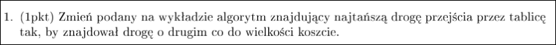
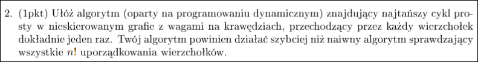
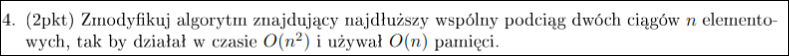
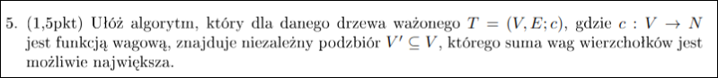
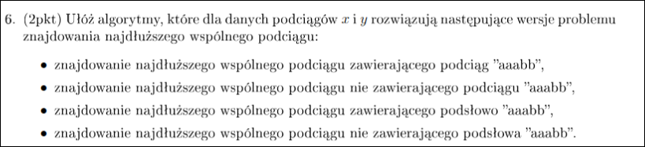
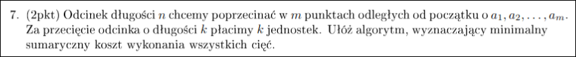
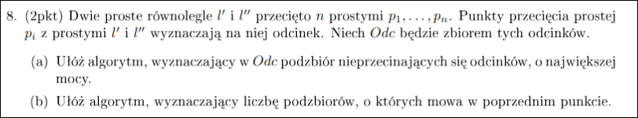

# Zadanie 1



W każdym wierzchołku pamiętamy drogę najkrótsza i drugą-najkrótszą.
Jak zachowamy ten niezmiennik, to na koniec wyznaczamy dwie najmniejsze wartości.

Jak trzeba odtwarzać ścieżkę no to więcej wskaźników pamiętamy :/

---

# Zadanie 2



**To jest problem komiwojażera (TSP), jest NP-zupełny!!!!**

$S$ - zbiór odwiedzonych wierzchołków (maska bitowa)
$v$ - ostatni wierzchołek w ścieżce
$Dp[S][v]$ - minimalny koszt ścieżki, która odwiedza każdy wierzchołek w $S$ dokładnie raz i kończy się w wierzchołku $v$.

**Rekurencyjna zależność:**
$Dp[S][v] = min(Dp[S-\{v\}][u] + weight(v, u))$ dla każdego $u$ z $S - \{v\}$ 

**Przypadek bazowy:**
$\forall v \in V\:\:Dp[\{v\}][v]=0$ 

```
fun FindSmallestCycleSize:

for s in subsets(S):
	for v in V(G):
		if v not in s:
			continue
		min_cost = inf
		for u in s - {v}: # we check each possible previous vertex
			if has_edge(u,v):
				min_cost = min(min_cost, Dp[s-{v}][u] + weight(v,u))
		Dp[s][v] = min_cost
```

**Lemat**
Po wywołaniu tej struktury w $Dp[S]$ będzie miało tablicę kosztów cykli, które przechodzą przez wszystkie wierzchołki dokładnie raz.

**D-d**
Naszym niezmiennikiem będzie to, że po każdym obrocie pętli $Dp[s]$ będzie zawierać najtańsze koszty ścieżek przechodzących przez każdy wierzchołek w $s$ dokładnie jeden raz i kończące się w jakimś wierzchołku $u$.

Mając taką tablicę możemy łatwo zrekonstruować cykl. Znajdujemy koszt najtańszego cyklu, będziemy wiedzieć, w którym wierzchołku się kończy (i zaczyna).

Niech $v$ to ostatni wierzchołek najtańszego cyklu.
Szukamy takiego $u$, które minimalizuje $Dp[S-\{v\}][u]$. Dodajemy $u$ do ścieżki.
Powtarzamy tę czynność dopóki nie dojdziemy do $Dp[\{v\}][v]$ 

---

# Zadanie 3


$Dp[x][y]$

**Rekurencyjna zależność:**
dla $dp[i][j]$ bierzemy najmniejsze z 3 na lewo, do góry, i lewo do góry
następnie w zależności, które wybraliśmy dodajemy elementy z ciągów X lub Y
elementy z ciągów X lub Y elementy z ciągów X lub Y

**Niezmiennik:**
$dp[x][y]$ zawiera długość najkrótszego słowa złożonego z x i y liter odpowiednio X i Y

**kod:**
```python
w1 = 'abc'
w2 = 'adc'

n = len(w1)
m = len(w2)

# shortest words
dp = [[0 for _ in range(n+1)] for _ in range(m+1)]

for i in range(m+1):
    for j in range(n+1):
        if j == 0:
            dp[i][j] = i
        elif i == 0:
            dp[i][j] = j
        elif w1[j-1] == w2[i-1]:
            # jeżeli litery pasują to dodajemy je tylko raz
            dp[i][j] = 1 + dp[i-1][j-1]
        else:
            # wpp bierzemy tańszą opcję z góry lub lewej i dokładamy
            dp[i][j] = 1 + min(dp[i-1][j], dp[i][j-1])
            
# rekonstrukcja słowa
i, j = m, n
result = []
while i > 0 and j > 0:
    if w1[j-1] == w2[i-1]:
        result.append(w1[j-1])
        j -= 1
        i -= 1
    elif dp[i-1][j] < dp[i][j-1]:
        result.append(w2[i-1])
        i -= 1
    else:
        result.append(w1[j-1])
        j -= 1

'''
while i > 0:
    result.append(w2[i-1])
    i -= 1
while j > 0:
    result.append(w1[j-1])
    j -= 1
'''

superseq = ''.join(reversed(result))
print(superseq)
```

Czemu musimy pod koniec wypistywać reszte elementow z ciagow w tych dwoch while'ach?

---

# Zadanie 4



**Sposób Hirschberga. Połączenie DP i dziel i zwyciężaj.**
Definicje:
LCS - długość longest common subsequence

$$lcs(i,j)=LCS(X[1..i], Y[1..j])$$
$$lcs(j,i) = \begin{cases}
0, \:\:\:i=0\:\vee j=0 \\
lcs(i-1,j-1)+1, \:\:\: i,j>0 \:\vee\:x_i=x_j\\
max(lcs(i-1,j), lcs(i, j-1)), \:\:\: i,j>0 \:\vee\:x_i \neq x_j
\end{cases}$$
Możemy też liczyć lcs od drugiej strony.
$$lcs'(i,j)=LCS(X[i..n], Y[j..n])$$
$$lcs'(j,i) = \begin{cases}
0, \:\:\:i=n\:\vee j=m \\
lcs'(i+1,j+1)+1, \:\:\: i,j<n \:\vee\:x_i=x_j\\
max(lcs'(i+1,j), lcs'(i, j+1)), \:\:\: i,j<n \:\vee\:x_i \neq x_j
\end{cases}$$

Niech S oznacza LCS X i Y. Niech $y_k$ to najbardziej na prawo element Y, taki, który przez S odpowiada elementowi w $X[1..\lfloor \frac{m}{2} \rfloor]$ (jeśli, nie ma takiego to $k = 0$).

## **Lemat 1**
równanie 3
$$
LCS(X,Y)=
\underset{1\leq l\leq n}{max}
\{lcs(\lfloor \frac{m}{2} \rfloor, l) + lcs'(\lfloor \frac{m}{2} \rfloor+1, l+1)\}
$$
**Dowód**
Z definicji $k$ pierwsza część S jest wspólnym ciągiem $X[1..\lfloor \frac{m}{2} \rfloor]$ i $Y[1..k]$, a reszta S to wspólny ciąg $X[\lfloor \frac{m}{2} \rfloor ..n]$ i $Y[k+1..n]$. Z tego wynika, że $L\leq P$.
Z drugiej strony $\forall l$  $lcs(\lfloor \frac{m}{2} \rfloor, l)$ i $lcs'(\lfloor \frac{m}{2} \rfloor+1, l+1)$ skonkatenowane jest wspólnym ciągiem $X$ i $Y$, czyli $L\geq P$.

## **Algorytm**
1) znajdź $k'$ maksymalizujące prawą stronę równania 3
2) znajdź rekurencyjnie ciągi $LCS(X[1..\lfloor \frac{m}{2} \rfloor], Y[1..k']$ oraz $LCS(X[\lfloor \frac{m}{2} \rfloor + 1..n], Y[k'+1..n])$
3) połącz wyniki

## **Znajdowywanie k'**
Możemy zrobić to w czasie $O(n^2)$ i pamięci $O(n)$.
**cel:** znaleźć $lcs(\lfloor \frac{m}{2} \rfloor, l)$ i $lcs'(\lfloor \frac{m}{2} \rfloor+1, l+1)$ dla każdego l.

Możemy mieć tablicę na $lcs$, znalezienie $lcs(\lfloor \frac{m}{2} \rfloor, \:l)$ dla każdego $l$ zajmie nam $O(n^2)$ czasu i $O(n)$ pamięci. Stosujemy fakt, że każda kolejna kolumna tablicy $DP$ w klasycznym algorytmie zależy tylko od poprzedniej. W ten sposób możemy zredukować użycie pamięci (nie przeszkadza nam też to, że w ten sposób nie możemy odtworzyć tego ciągu). W tym przypadku mamy po prostu pętlę od 1 do n.

Teraz musimy obliczyć $lcs'$. To liczymy podobnie jak $lcs$, tylko, że od tyłu. Robimy to w taki sposób, że odwracamy dwa rozpatrywane ciągi i liczymy $lcs$ klasycznym sposobem (potem trzeba indeksowanie ponaprawiać TODO)

## Rekurencyjne wywołanie
Wywołujemy się rekurencyjnie dla  $X[1..\lfloor \frac{m}{2} \rfloor]$ i $Y[1..k']$ oraz dla $X[\lfloor \frac{m}{2} \rfloor + 1..n]$ i $Y[k'+1..n]$. 
Przypadki bazowe to
- długość pierwszego stringa dojdzie do 1, wtedy zwracamy jedną literę lub nic, co można sprawdzić poprzez przejście przez drugi ciąg znaków (ten przypadek zawsze zajdzie, ponieważ zawsze dzielimy długość jednego stringa na 2).
- gdy długość $Y$ będzie 0, wtedy zwracamy pusty string (stanie się tak, gdy $k'=n$).

## Konkatenacja wyników
trywialne

## Złożoność
Pierwszy krok to $O(n^2)$ czasu i $O(n)$ pamięci. Po znalezieniu $k'$ wywołujemy się na 2 razy mniejszym obszarze.
#TODO Fix obrazka
![[Pasted image 20250428084120.png]]

Możemy oszacować czas jako:
$$O(n^2)\cdot\sum_{i=0}^{\infty}\frac{1}{2^i}=2\cdot O(n^2)=O(n^2)$$

Dodatkowo jest czas skanowania, kiedy dojdziemy do liścia, ale ono jest wykonywane tylko raz dla każdego liścia (w najgorszym przypadku byłoby $O(n^2)$)

Na każdym poziomie rekursji potrzebujemy łącznie $O(n)$ pamięci, ale tylko do obliczenia $k'$. Zatem możemy je obliczyć i potem udostępnić tę pamięć dla kolejnych poziomów rekursji (w skrócie cały program może współdzielić tą pamięć).

Głębokość rekursji to $log\:n$, na każdym poziomie musimy pamiętać tylko dwie liczby wskazujące na indeksy stringów. 

Złożoność pamięciowa to 
$$O(n + log\:n)=O(n)$$

Poprawność wynika z lematu 1.

---

# Zadanie 5



**Fakt:**
$$\forall v\in V \: \forall w\in V \:\:d(v,w) \geq 2 \Rightarrow vw \cancel{\in}E$$
Dowód tego faktu wynika z tego, że mamy do czynienia z drzewem.

Dodając kolejne wierzchołki niezależne możemy tylko zwiększyć sumę wag. Dlatego nie ma sensu zostawiać więcej niż dwa pod rząd niewybrane na ścieżce prostej.

## Naiwny sposób 

```
fun DFS1(v, p, (score_with, score_without))
	new_score = (score_without + c(v), score_with)
	scores[v] = new_score
	// check if new_score is the new max
	for e in G(v):
		if p == e: continue
		DFS1(e, v new_score)
```

Z każdego wierzchołka wywołujemy tę metodę. $scores[v][0]$ oznacza sumę wag do tej pory z $v$ wybranym a 1 bez $v$ wybranego. W tej metodzie zachłannie wybieramy wierzchołki, ale to okej, bo 2

## Dziel i zwyciężaj

1) znajdź centroid i dla niego wywołaj się rekurencyjnie
2) po tym jak mamy maksymalne zbiory niezależne dla poddrzew centroidu to mamy dwie opcje
	1) centroid będzie w finalnym zbiorze niezależnym
	2) centroid w nim nie będzie

Tutaj trzeba jakoś sprawdzić czy opłaca się brać centroid
Dla każdego poddrzewa możemy sprawdzać maksymalne podzbiory zawierające i niezawierające korzenia
Wtedy jeśli centroid ma dużą wagę to możemy dla każdego poddrzewa wziąć jego wersję bez korzenia plus centroid

docelowo czasowo mamy $O(n logn)$ 

## DP
Definiujemy DP dla drzewa.
$DP[v]$ zawiera krotkę
1) max suma wag niezależnego podzbioru w poddrzewie $v$, zawierającym $v$
2) max suma wag niezależnego podzbioru w poddrzewie $v$, niezawierającym $v$

```python
def solve(tree, root, c):
    N = 10
    DP = [[0,0] for _ in range(N)]
    # DP[v][0] -> sum_f, includes v
    # DP[v][1] -> sum_g, doesn't include v
    def dfs(v, p):
        '''Filling DP table'''
        sum_f = c(v)
        sum_g = 0
        for w in tree[v]:
            if w == p: continue
            dfs(w, v)
            sum_f += DP[w][1]
            sum_g += max(DP[w][0], DP[w][1])
        DP[v] = [sum_f, sum_g]
    dfs(root, -1)
    V = []
    def recreate_set(v, p, take_node):
        if take_node:
            # we take current node
            V.append(v)
            # we go through its children, we don't take those
            for u in tree[v]:
                if u == p: continue
                recreate_set(u, v, False)
        else:
            for u in tree[v]:
                if u == p: continue
                # we add children node only if independent set with it included
                # has higher value than this without it
                recreate_set(u, v, DP[u][0] > DP[u][1])
    recreate_set(root, -1, DP[root][0] > DP[root][1])
    return V
```

Czas działania $O(n)$, pamięciowo $O(n)$.

### Dowód poprawności
1) Zwróci największy independent set
	**Fakt:** $DP[v]$ zawiera rozmiary niezależnych zbiorów dla poddrzewa zakorzenionego w $v$, z $v$ i bez $v$.
	Dla liści jest to oczywiste. 
	Dla dowolnego $v$ łatwo zauważyć, że jak nie bierzemy $v$, to możemy wziąć wszystkie największe zbiory z poddrzew dzieci $v$ (wybieramy z pośród tych zawierających dzieci jak i nie).
	Jeśli bierzemy $v$ to możemy brać tylko te największe podzbiory nie zawierające dzieci $v$.

2) Nie jest ważne, z którego wierzchołka zaczynamy

---

# Zadanie 6



---
# Zadanie 7



**Obserwacja:**
Jeżeli zdecydujemy się wykonać najpierw cięcie w punkcie $a_i$, to wyznaczenie kolejności wykonywania cięć $a_{k<i}$ oraz $a_{k > i}$ są oddzielnymi problemami nie wpływającymi na siebie.
Raczej oczywiste, a jak nie, to wziąć dowolne dwa przeplatania kolejności i pokazać, że mają identyczny koszt.

Ta obserwacja prowadzi nas do następującego równania:
$$\begin{align*}
dp[i][j] &= \text{minimalny koszt wykonania podziałów } a_{i},\dots,a_{j} \text{ na odcinku } [a_{i}, a_{j}] \\
&= \begin{cases}
0 &: j - i \le 1 \\
\min_{k\in\{i+1,\dots,j-1\}}(dp[i][k] + dp[k][j] + a_{j} - a_{i}) &: \text{w p.p.}
\end{cases}
\end{align*}$$
> Dla wygody przyjmujemy $a_{0} = 0, a_{m+1} = n$, wtedy odpowiedź to $dp[0][m+1]$.

### Dowód Poprawności

Chyba widać...

### Optymalizacja

Dla tego $dp$ można zastosować *optymalizację Knuth'a*, by złożoność wynosiła $O(n^{2})$, a nie $O(n^{3})$.

---

# Zadanie 8



## A

Sortujemy odcinki po punktach przecięcia z $l'$. Znajdujemy LIS punktów przecięcia z $l''$.
Dwie proste przecinają się wtw, gdy ich punkty są w innej kolejności na obydwu prostych.

**Algorytm do znajdowania LIS:**

```python
def find_LIS(sequence):
    n = len(sequence)
    if n == 0:
        return []

    tails = []            # wartości końcowe LIS-ów o danej długości
    pos = []              # indeksy końcówek LIS-ów
    prev = [-1] * n       # poprzednik każdego elementu w LIS

    for i in range(n):
        # obecnie rozpatrywany element tablicy
        x = sequence[i]
        # patrzymy, czy istnieje w tails element, który możemy podmienić na lepszy
        j = bisect_left(tails, x)  # najniższy indeks z tails[j] >= x

        if j == len(tails):
            tails.append(x)
            pos.append(i)
        else:
            tails[j] = x
            pos[j] = i

        if j > 0:
            prev[i] = pos[j - 1]

    # Rekonstrukcja LIS
    lis = []
    k = pos[-1]
    while k != -1:
        lis.append(sequence[k])
        k = prev[k]

    lis.reverse()
    return lis

```

**Dowód poprawności:**
Niezmiennik: po każdym obrocie pętli `tails` zawiera najmniejsze elementy będące na końcu LIS o odpowiednich długościach dla podtablicy `A[0..i]`.
**D-d**
Przed rozpoczęciem jest to prawdą, bo mamy tylko jeden element.
Załóżmy, że po i-tym przejściu pętli jest to prawdą. Bierzemy najmniejszy indeks `j` taki, że $tails[j] \geq A[i]$. 
1) nie ma takiego indeksu, czyli możemy przedłużyć LIS (dodajemy `A[i]` na koniec tails)
2) skoro jest takie `j` to podmieniamy `tails[j]` na `A[i]` i teraz `tails[j]` zawiera najmniejszy element kończący LIS o długości `j`

Niech i to indeks ostatniego elementu `tails`. Czyli LIS ma długość i i jego ostatni element to `tails[i]`

Rekonstrukcja działa tak, że `pos[j]` trzyma indeks w tablicy `A` elementu na `tails[j]`. Natomiast `prev[i]`

## B

Tym razem zliczamu ile jest LIS.

**Kod do zliczania LIS:**

```python
def findNumberOfLIS(A):
    dp = [[0, 0] for _ in range(len(A))]
    lenLIS, count = 0, 0

    for i in range(len(A) - 1, -1 , -1):
        maxLen, maxCnt = 1, 1
        for j in range(i + 1, len(A)):
            if A[j] > A[i]:
                length, count = dp[j]
                if length + 1 > maxLen:
                    maxLen, maxCnt = length + 1, count
                elif length + 1 == maxLen:
                    maxCnt += count

        if maxLen > lenLIS:
            lenLIS, count = maxLen, maxCnt
        elif maxLen == lenLIS:
            count += maxCnt
        dp[i] = [maxLen, maxCnt]

    return count
```

Czas: $O(n^2)$
Dowód: `dp[i]` zawiera długość i ilość LIS zaczynających się na `A[i]`.
