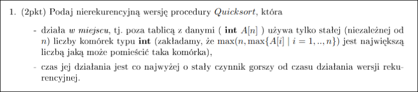
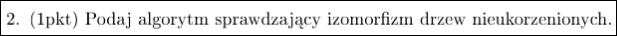
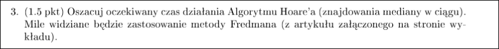
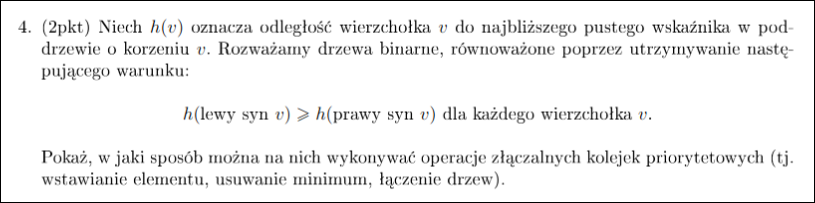
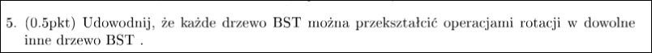
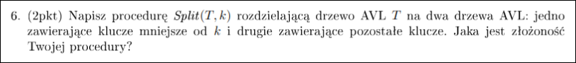
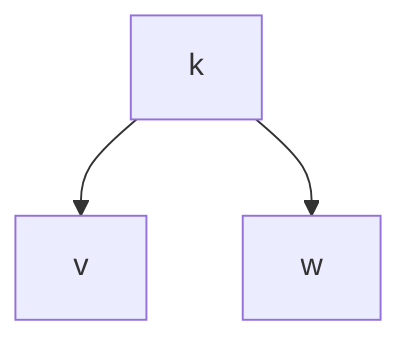
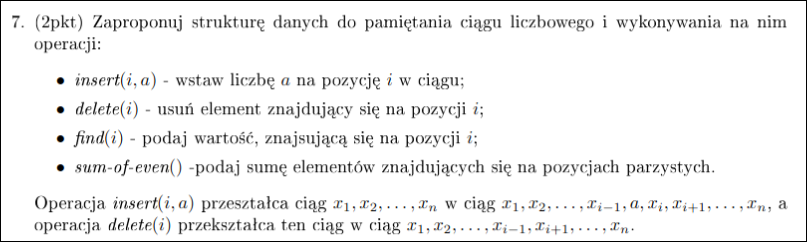
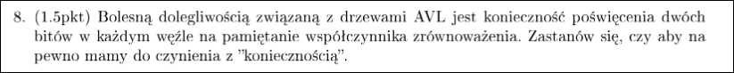

# Zadanie 1



Partition działa tak samo jak w zwykłym Quicksort.

pętla while od 0 do n

symulujemy rekurencję. Wybieramy pivota w sposób losowy. Potem szukamy maks i drugiego maks w prawej części tablicy. Ustawiamy drugi maks za pivotem, a maks na koniec tego przedziału. Idziemy w lewą część rekursji. Po wyjściu z lewej części rekursji przechodzimy o dwa kroki w prawo. Trafimy na ten drugi największy. Potem idziemy w prawo dopóki nie znajdziemy większego elementu. W ten sposób odtworzymy przedział na prawe wywołanie rekurencyjne.

---

# Zadanie 2



Znajdziemy centroidy obydwu drzew i dla każdej ich kombinacji uruchomimy algorytm sprawdzający izomorfizm drzew ukorzenionych.

Znajdowanie centroidy możemy zrobić w czasie liniowym DFS-em.

---

# Zadanie 3



**Algorytm Hoare'a**

Dla znajdowania mediany $k=\frac{n}{2}$.

```
def Selection(T, k):
	if |T| małe then sort i select
	p <- losowy element z T
	U <- elementy T mniejsze od p
	if k <= |U|
		then return Selection(U, k)
		else return Selection(T - U, k - |U|)
```

## Wersja insistent

Niech główne wywołanie `Selection` to wywołanie poziomu $0$. W ogólności W ogólności niech 
wywołania poziomy $k$ to te wywołane przez wywołania $k-1$. 

W idealnych warunkach wybrany pivot dałby taki podział, że większy fragment
byłby nie większy niż $\frac{3}{4}$ pod-tablicy rodzica (zbalansowany podział).

Wersja insistent wybiera pivota dopóki nie znajdzie zbalansowanego podziału.

Taka wersja usuwa niepewność co do przetwarzanego rozmiaru pod-tablicy. 
Rozmiar tablicy przetwarzanej przez wywołanie na poziomie $k$ jest maksymalnie 
$(\frac{3}{4})^k\cdot n$, bo wszystkie podziały są zbalansowane. Zatem skoro 
pod-tablice rozmiaru 0 i 1 są tymi, na których algorytm się kończy to 
maksymalna wartość $k$ to $O(log\;n)$.

Prawdopodobieństwo, że dany kandydat na pivota okaże się tym dobrym jest co
najmniej $\frac{1}{2}$. Z tego wynika, że oczekiwana ilość pracy na 
stworzenie odpowiedniego pivota jest co najwyżej 2 razy wielkość pod-tablicy
nad którą pracuje pod-zapytanie.

Dla ustalonego $k$ jest tylko jedno wywołanie na tym poziomie. Nie jest tak, 
jak w quicksort, że w każdym węźle rozbijamy się na dwa rekurencyjne wywołania.
Drzewo wywołań rekurencyjnych to ścieżka.

Na $k$-tym poziomie rozmiar pod-tablicy nad którą pracujemy to maksymalnie $(\frac{3}{4})^k\cdot n$.
Niech $E(v)$ to oczekiwana praca wykonana przez wywołanie $v$.
Dla $v$ na poziomie $k$: $E(v) = 2\cdot(\frac{3}{4})^k\cdot n$
Łączny koszt:

$$
\sum_{k=1}^{logn}2\cdot(\frac{3}{4})^k\cdot n =
2n\sum_{k=1}^{logn}\cdot(\frac{3}{4})^k \leq
2n\sum_{k=1}^{\infty}\cdot(\frac{3}{4})^k =
6n
$$

## Wersja zwykła

Niech $T$ to unarne drzewo wywołań rekurencyjnych procedury `Selection`.

todo: przepisać ze zdjęcia z tablicy

---

# Zadanie 4



To jest kopiec lewicowy

**Lemat:** $h(v.right) \leq \log(n+1)$ 

**Lemat:** Długość skrajnie prawej ścieżki z wierzchołka $v$ to $h(v.right)$
ten lemat daje nam ograniczenie na czas działania $merge$.

Wszystkie operacje opierają się na operacji $merge$ 

---

# Zadanie 5



---

# Zadanie 6



Napiszemy rekurencyjną procedurę, która zwraca dwa drzewa (jedno z nich może być wierzchołkiem, który ma jedno dziecko AVL). Jedno drzewo ma wierzchołki mniejsze od $k$, a drugie nie większe.

**Przypadek bazowy**

Jesteśmy w wierzchołku $k$. Poddrzewo $v$ zawiera klucze mniejsze od $k$ i jest drzewem AVL, więc po prostu je zwracamy. 

Jeśli nie jesteśmy w korzeniu to zwracamy poddrzewo $v$ i $k$ z jednym dzieckiem. W p.p. żeby otrzymać drzewo z pozostałymi wierzchołkami robimy $insert(w, v)$ w czasie $O(\log n)$ i dostajemy drzewo z wierzchołkami nie mniejszymi od $k$.



**Przypadek indukcyjny**

Jesteśmy w wierzchołku $v$, rozważmy opcje:

Wywołujemy się rekurencyjnie na dziecku (w zależności czy $k > v.key$).
Rekurencyjnie dostaniemy drzewa $L$ i $R$ z podziału poddrzewa $v$.

BSO wywołujemy się na $v.right$.

**Operacja join(T1, T2, p)**
łączy drzewa T1,T2 i wierzchołek $p$.
$\forall v \in T_1$ $v < p$, $\forall v' \in T_2$ $v' > p$.
dwa proste przypadki, gdzie T_1, T_2 różnią się wysokościami o co najwyżej 1, wtedy podwieszamy je pod $p$.

Przypadek gdy różnią się wysokościami o przynajmniej 2. BSO $h(T_1) \geq h(T_2)+2$.
Idziemy skrajnie prawą ścieżką aż trafimy na $v$, że $h(v) \leq h(T_2)$ (znajdziemy takie z indukcji).

potem wyjmujemy $v$ z drzewa podczepiamy z $T_2$ pod $p$ i wczepiamy $p$ w stare miejsce $v$. Jeśli wyjdzie nam, że w ojcu $v$ jest niebalans to naprawiamy to rotacją.

Koszt join: $O(|h(T_1) - h(T_2)|)$.

Dostajemy $L$, $R$ z wywołania rekurencyjnego (i wartość bool mówiąca czy w $k$ jest w tych drzewach).

zwracam $join(v.left, L, v)$, R, b

---

# Zadanie 7



Indeksowanie to kolejność in-order tego drzewa binarnego.

Użyjemy do tego drzewa AVL. Operacje będą bardzo podobne do drzewa AVL, teraz kluczami są indeksy i każdy wierzchołek oprócz klucza $i$ kojarzoną wartość $x_i$.

Dla każdego wierzchołka $v$ jego pozycja w ciągu to $size(v.left)$ + pozycja rodzica (jeśli wierzchołek jest prawym dzieckiem). Ten wzór jest po to, żeby z wizualizować sobie szukanie elementów. Sam w sobie nie da faktycznych indeksów.

$size$ dla wierzchołka $v$ jest aktualizowany przy wstawianiu, usuwaniu i rotacjach.

## find

Żeby znaleźć $i$-ty element postępujemy w następujący sposób (załóżmy, że jesteśmy w wierzchołku $v$):
1) $L \leftarrow size(v.left)$
2) Jeśli: 
	1) $i < L$ to szukamy w lewym poddrzewie
	2) $i = L$ znaleźliśmy wierzchołek
	3) $i > L$ szukamy w prawym poddrzewie z $i' = i - L$/$i'=size(v.left)-L-1$

**Koszt:** $O(\log n)$
## insert

Działa tak samo jak w AVL. Szukanie miejsca na wstawienie odbywa się za pomocą tego samego schematu co w $find$.

**Lemat**
Rotacja zachowuje kolejność elementów w ciągu. Albo inaczej: rotacje nie psuje porządku in-order.

**Koszt:** $O(\log n)$
## delete

Działa tak samo jak w AVL. Rotacje zachowują kolejność elementów.

**Koszt:** $O(\log n)$
## sum of even

linowo, przejście in-order po wierzchołkach

---

# Zadanie 8



Zamiast dwóch bitów w węźle można trzymać po jednym bicie w każdym dziecku. Wtedy zmniejszymy ilość bitów o co najmniej połowę.